# Novel MVP Android App

An AI-powered storytelling Android application built with modern Android development practices and Jetpack Compose.

## 📱 Overview

This Android app allows users to have conversations with an AI and generate personalized novels based on their interactions. The app supports both text and voice input, with real-time speech-to-text transcription and text-to-speech capabilities.

## 🏗️ Architecture

### MVI (Model-View-Intent) Pattern

This app follows the **MVI (Model-View-Intent)** architecture pattern, which is a unidirectional data flow pattern that makes state management predictable and testable.

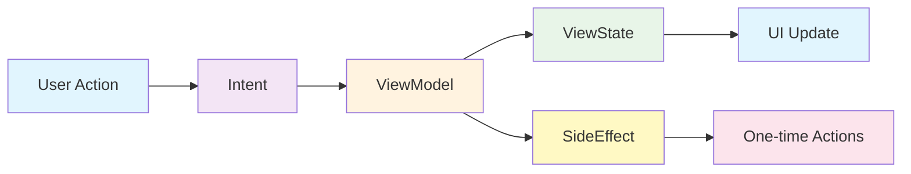

### Project Structure

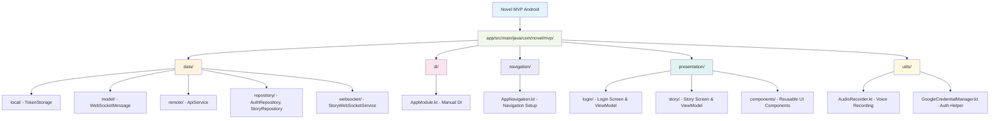

## 🛠️ Technology Stack

### Core Technologies
- **Kotlin**: Primary programming language
- **Jetpack Compose**: Modern declarative UI toolkit
- **Coroutines & Flow**: Asynchronous programming and reactive streams
- **Ktor Client**: HTTP client for API calls and WebSocket communication

### Key Libraries
- **Kotlinx Serialization**: JSON serialization/deserialization
- **Google Credential Manager**: Google Sign-In integration
- **Android AudioRecord**: Voice recording functionality

### Architecture Patterns
- **MVI (Model-View-Intent)**: Unidirectional data flow
- **Repository Pattern**: Data access abstraction
- **Dependency Injection**: Manual DI for simplicity

## 🎯 Key Features

### 1. Authentication Flow

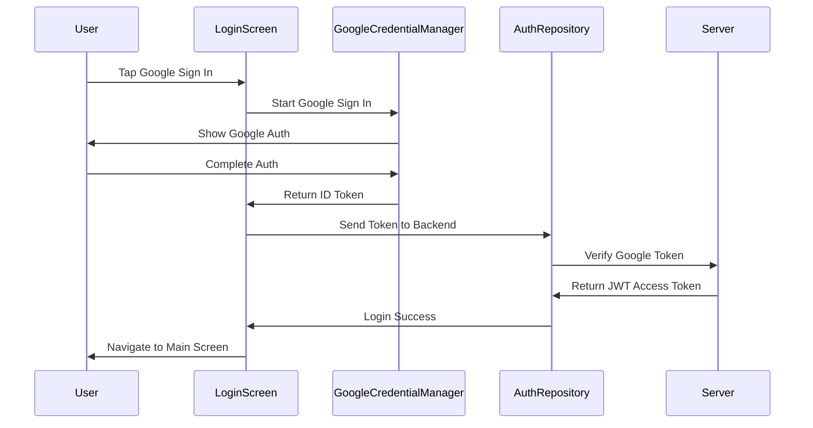

### 2. Voice Input Flow

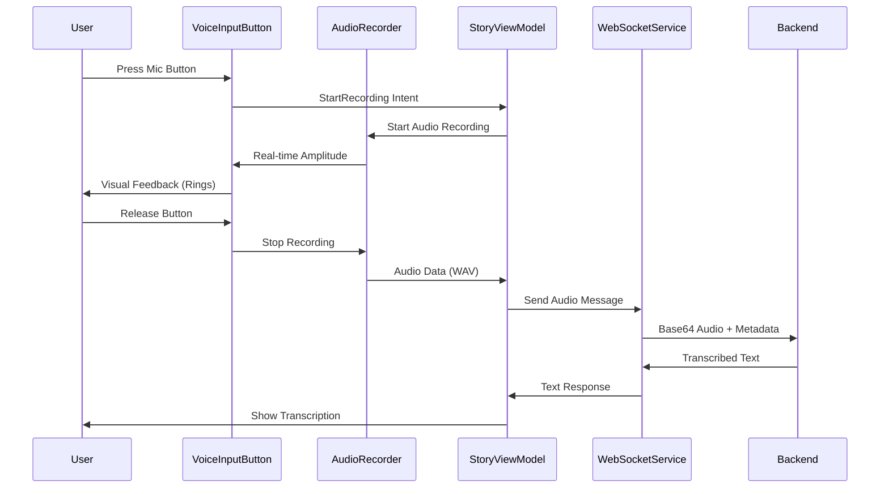

### 3. Real-time Communication

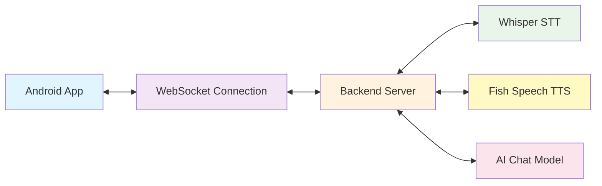

## 📋 Understanding MVI in This Project

### MVI Data Flow Example

```mermaid
graph TD
    A[User taps Voice Button] --> B[StoryIntent.StartRecording]
    B --> C[ViewModel.handleIntent()]
    C --> D[Update ViewState.isRecording = true]
    C --> E[Emit SideEffect.StartAudioRecording]
    D --> F[UI recomposes with recording state]
    E --> G[LaunchedEffect handles side effect]
    G --> H[AudioRecorder starts recording]
    H --> I[Real-time amplitude updates]
    I --> J[UI shows animated rings]
    
    style A fill:#e3f2fd
    style B fill:#f1f8e9
    style C fill:#fff3e0
    style D fill:#e8f5e8
    style E fill:#fff9c4
    style F fill:#e1f5fe
    style G fill:#fce4ec
    style H fill:#e8eaf6
    style I fill:#e0f2f1
    style J fill:#fff8e1
```

### WebSocket Message Types

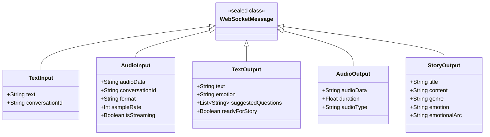

## 🗂️ Data Layer Architecture

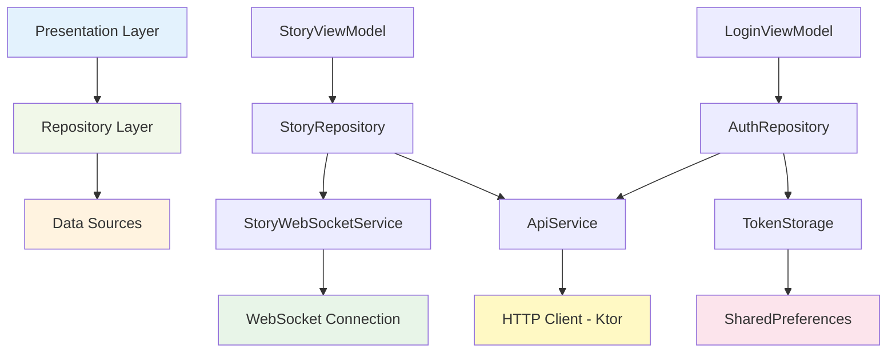

## 🎨 UI Component Hierarchy

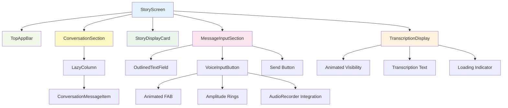

## 🔧 Setup and Running

### Prerequisites
- Android Studio Arctic Fox or later
- Android SDK 24+ (Android 7.0)
- Kotlin 1.8+

### Setup Steps

1. **Clone the repository**:
   ```bash
   git clone <repository-url>
   cd novel-mvp/novel-mvp-android
   ```

2. **Open in Android Studio**:
   - Open Android Studio
   - Select "Open an existing project"
   - Navigate to `novel-mvp-android` folder

3. **Sync project**:
   - Android Studio will automatically prompt to sync Gradle
   - Wait for sync to complete

4. **Run the app**:
   - Connect an Android device or start an emulator
   - Click "Run" button or press `Ctrl+R` (Windows/Linux) or `Cmd+R` (Mac)

### Configuration

The app connects to a backend server running on `10.0.2.2:8080` (Android emulator localhost). 

To change the server URL, modify:
```kotlin
// StoryWebSocketService.kt
private const val WS_URL = "ws://YOUR_SERVER_IP:8080/ws/novel"

// ApiService.kt  
private const val BASE_URL = "http://YOUR_SERVER_IP:8080"
```

## 🚀 Adding New Features

### State Management Flow

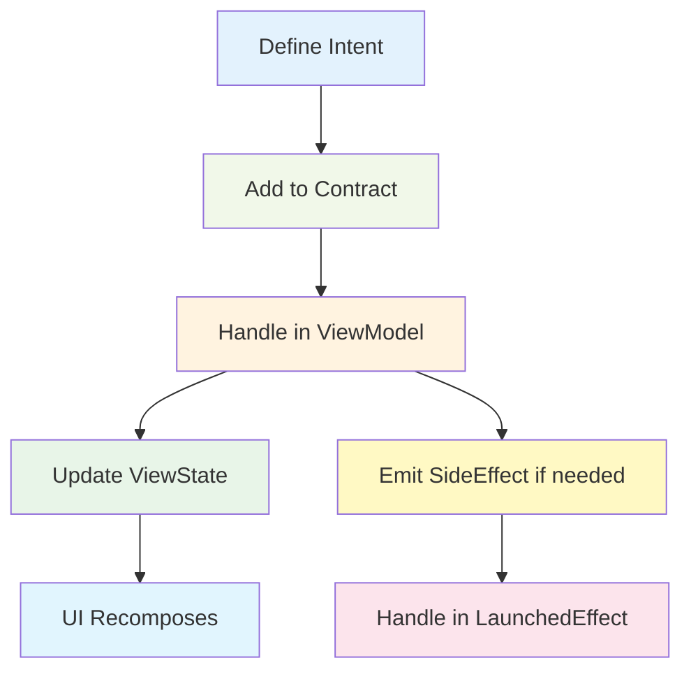

### Example: Adding a New Feature

1. **Create the contract** (define Intent, ViewState, SideEffect):
   ```kotlin
   // presentation/newfeature/NewFeatureContract.kt
   sealed class NewFeatureIntent {
       object LoadData : NewFeatureIntent()
   }
   
   data class NewFeatureViewState(
       val isLoading: Boolean = false,
       val data: List<String> = emptyList()
   )
   
   sealed class NewFeatureSideEffect {
       data class ShowError(val message: String) : NewFeatureSideEffect()
   }
   ```

2. **Create the ViewModel**:
   ```kotlin
   class NewFeatureViewModel : ViewModel() {
       private val _viewState = MutableStateFlow(NewFeatureViewState())
       val viewState: StateFlow<NewFeatureViewState> = _viewState.asStateFlow()
       
       private val _sideEffect = MutableSharedFlow<NewFeatureSideEffect>()
       val sideEffect: SharedFlow<NewFeatureSideEffect> = _sideEffect.asSharedFlow()
       
       fun handleIntent(intent: NewFeatureIntent) {
           when (intent) {
               is NewFeatureIntent.LoadData -> loadData()
           }
       }
   }
   ```

## 🐛 Common Issues and Solutions

### Debugging Flow

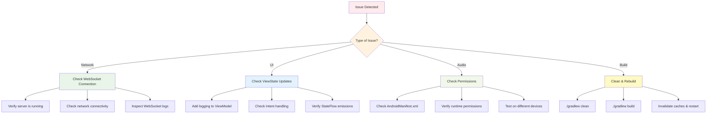

## 📚 Learning Path for Beginners

### Recommended Learning Order

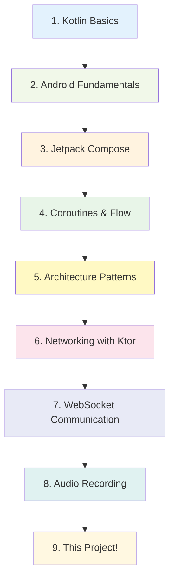

### Key Concepts to Understand

1. **Kotlin Coroutines**: How async operations work
2. **Jetpack Compose**: Declarative UI framework
3. **StateFlow vs SharedFlow**: State vs Events
4. **Lifecycle-aware Components**: ViewModels and their lifecycle
5. **Dependency Injection**: How components get their dependencies
6. **WebSocket vs HTTP**: Real-time vs request-response communication

## 🤝 Contributing

When contributing to this project:

1. Follow the existing MVI architecture pattern
2. Add proper documentation for new features
3. Write unit tests for new ViewModels
4. Follow Kotlin coding conventions
5. Update this README if you add new major features

## 📄 License

This project is part of the Novel MVP application suite.