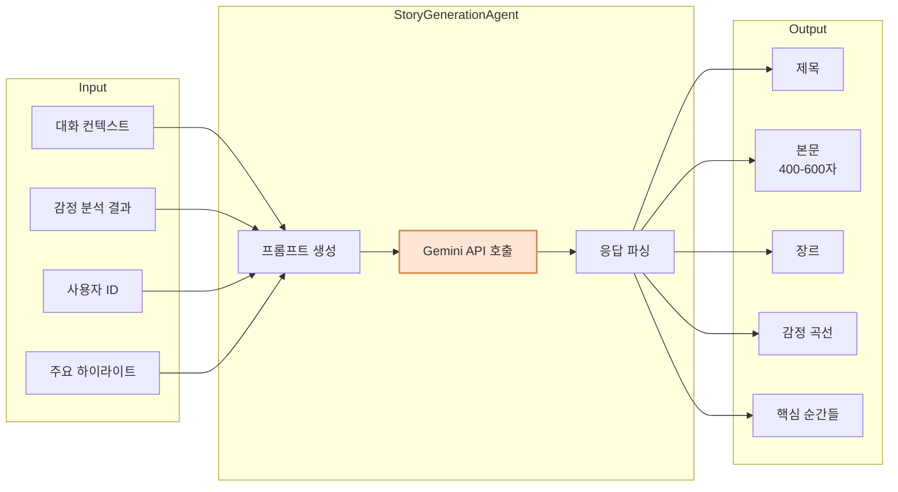
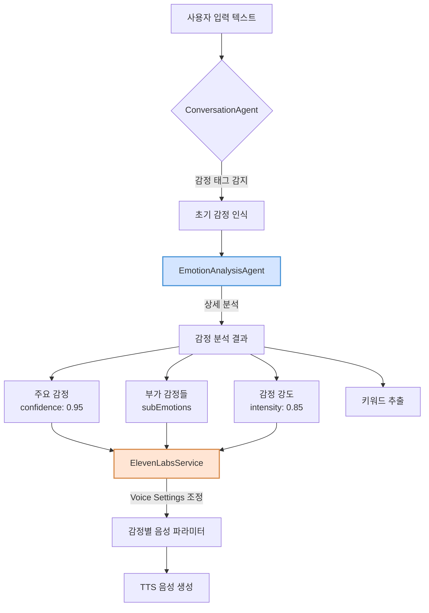
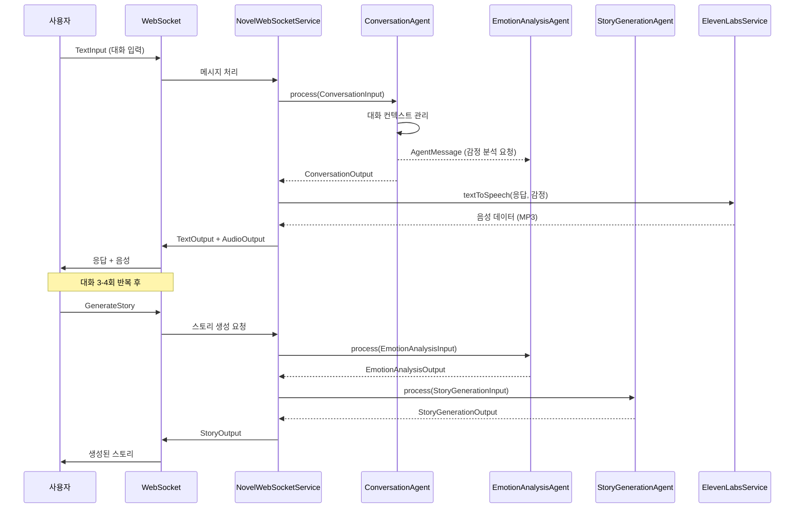
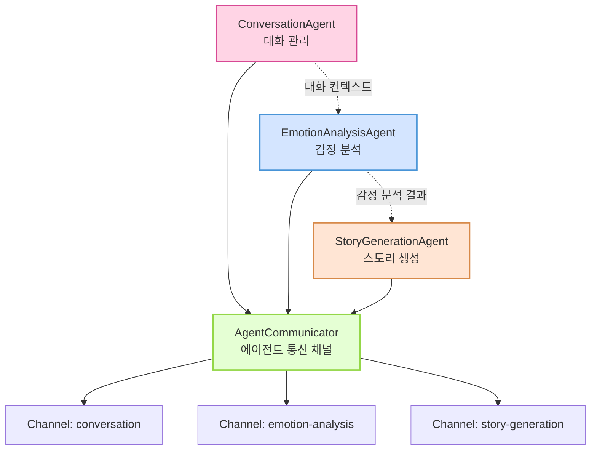
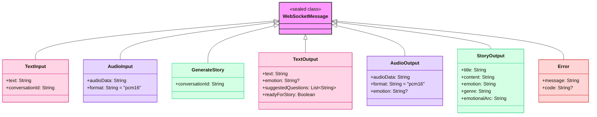
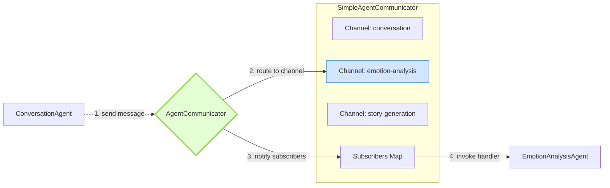

# Novel MVP Backend

AI 기반 대화형 스토리텔링 시스템 - 사용자의 일상 대화를 감성적인 단편 소설로 변환

## 🌟 프로젝트 개요

Novel MVP는 사용자와의 자연스러운 대화를 통해 일상의 이야기를 수집하고, 이를 개인화된 감성 소설로 변환하는 멀티 에이전트 AI 시스템입니다. WebSocket 기반 실시간 통신과 한국어 음성 인식/합성을 지원합니다.

## 🚀 핵심 기능

### 1. 실시간 대화 시스템
- WebSocket 기반 양방향 실시간 통신
- 자연스럽고 공감적인 AI 대화 에이전트
- 대화 컨텍스트 관리 및 이야기 수집

### 2. 감정 인식 및 분석
- 문장별 감정 분석 (10가지 감정 카테고리)
- 감정 강도 및 변화 추적
- 키워드 기반 감정 맥락 파악

### 3. AI 스토리 생성
- Google Gemini 2.5 기반 창의적 스토리 생성
- 대화 내용과 감정을 반영한 개인화된 소설
- 400-600자 분량의 감성적인 단편 소설



### 4. 음성 인터페이스
- ElevenLabs API 기반 고품질 음성 합성
- 감정이 반영된 자연스러운 음성 생성
- 다국어 지원 (29개 언어)

## 🛠 기술 스택

### Backend Framework
- **Language**: Kotlin
- **Framework**: Ktor 2.x
- **Build Tool**: Gradle (Kotlin DSL)

### AI/ML
- **대화 AI**: OpenAI GPT-4 (모델: gpt-4-turbo)
- **감정 분석**: OpenAI GPT-4 (모델: gpt-4-turbo)
- **스토리 생성**: Google Gemini 2.5 Flash
- **음성 처리**: ElevenLabs API (고품질 TTS)

### Architecture
- **Pattern**: Multi-Agent System with Message-Based Communication (A2A 패턴 개념 차용)
- **Protocol**: WebSocket (RFC 6455)
- **Serialization**: Kotlinx Serialization (JSON)

## 📦 의존성

```kotlin
dependencies {
    // Ktor Server
    implementation("io.ktor:ktor-server-core:2.x")
    implementation("io.ktor:ktor-server-netty:2.x")
    implementation("io.ktor:ktor-server-websockets:2.x")
    implementation("io.ktor:ktor-server-content-negotiation:2.x")
    
    // AI SDKs
    implementation("com.aallam.openai:openai-client:4.0.1")
    implementation("com.google.genai:google-genai:1.7.0")
    
    // Utilities
    implementation("io.github.cdimascio:dotenv-kotlin:6.x")
    implementation("ch.qos.logback:logback-classic:1.x")
}
```

## 🚦 시작하기

### 1. 환경 설정

`.env` 파일 생성:
```bash
OPENAI_API_KEY=sk-your-openai-api-key
GEMINI_API_KEY=your-gemini-api-key
ELEVENLABS_API_KEY=your-elevenlabs-api-key
```

### 2. ElevenLabs 설정
```bash
# ElevenLabs API 키 획득: https://elevenlabs.io
# 무료 플랜: 월 10,000자까지 사용 가능
```

### 3. 애플리케이션 실행
```bash
# 개발 모드
./gradlew run

# 프로덕션 빌드
./gradlew shadowJar
java -jar build/libs/novel-mvp-backend-all.jar
```

## 📡 API 사용법

### WebSocket 엔드포인트
```
ws://localhost:8080/ws/novel
```

### 메시지 프로토콜

> **중요**: WebSocket 메시지는 Kotlinx Serialization의 sealed class를 사용합니다. 
> 메시지 타입은 `type` 필드에 클래스 이름만 지정하면 됩니다 (전체 패키지명 불필요).

#### 입력 메시지

**텍스트 입력**
```json
{
  "type": "TextInput",
  "text": "오늘 카페에서 오랜 친구를 만났어요",
  "conversationId": "unique-conversation-id"
}
```

**음성 입력** (현재 지원 안함)
```json
{
  "note": "ElevenLabs는 TTS만 지원하므로 음성 입력은 현재 비활성화됨"
}
```

**스토리 생성 요청**
```json
{
  "type": "GenerateStory",
  "conversationId": "unique-conversation-id"
}
```

#### 출력 메시지

**텍스트 응답**
```json
{
  "type": "TextOutput",
  "text": "오랜 친구와의 만남이라니 정말 반가우셨겠어요! 어떤 이야기를 나누셨나요?",
  "emotion": "HAPPY",
  "suggestedQuestions": [
    "그 친구와는 얼마만에 만나신 건가요?",
    "가장 기억에 남는 대화는 무엇이었나요?",
    "만나서 어떤 기분이 드셨나요?"
  ],
  "readyForStory": false
}
```

**음성 응답** (ElevenLabs 고품질 음성)
```json
{
  "type": "AudioOutput",
  "audioData": "base64_encoded_audio",
  "format": "mpeg",
  "emotion": "HAPPY"
}
```

> **주의**: 실제 서비스는 MP3(audio/mpeg) 형식을 반환하지만, 메시지 형식은 "pcm16"으로 불일치가 있음

**생성된 스토리**
```json
{
  "type": "StoryOutput",
  "title": "시간을 건너온 우정",
  "content": "카페 문을 열고 들어서는 순간, 익숙한 실루엣이 눈에 들어왔다...",
  "emotion": "NOSTALGIC",
  "genre": "일상",
  "emotionalArc": "그리움에서 시작해 따뜻한 위로로 마무리되는 여정"
}
```

## 🎭 감정 카테고리

### 감정 처리 플로우



시스템이 인식하고 표현하는 감정:

| 감정 | 코드 | 설명 |
|------|------|------|
| 행복 | HAPPY | 기쁨, 즐거움, 만족감 |
| 슬픔 | SAD | 우울, 아쉬움, 상실감 |
| 설렘 | EXCITED | 기대, 흥분, 두근거림 |
| 평온 | CALM | 안정, 편안함, 고요함 |
| 화남 | ANGRY | 분노, 짜증, 불만 |
| 감사 | GRATEFUL | 고마움, 감동, 뿌듯함 |
| 불안 | ANXIOUS | 걱정, 초조, 긴장 |
| 그리움 | NOSTALGIC | 추억, 회상, 아련함 |
| 자랑스러움 | PROUD | 성취감, 뿌듯함, 자부심 |
| 실망 | DISAPPOINTED | 낙담, 허탈, 아쉬움 |

## 🏗 아키텍처

### 시스템 전체 플로우



### 멀티 에이전트 시스템



### 주요 컴포넌트

1. **ConversationAgent**: 사용자와의 대화 관리
2. **EmotionAnalysisAgent**: 텍스트 감정 분석
3. **StoryGenerationAgent**: 창의적 스토리 생성
4. **ElevenLabsService**: 고품질 음성 합성
5. **NovelWebSocketService**: WebSocket 통신 관리

### 🔧 에이전트 시스템 상세 구조

#### Agent.kt - 에이전트 인터페이스 정의

**기본 Agent 인터페이스**
```kotlin
interface Agent<TInput, TOutput> {
    val name: String
    suspend fun process(input: TInput): TOutput
}
```
- 모든 에이전트가 구현해야 하는 기본 인터페이스
- 제네릭 타입으로 유연한 입출력 정의
- 코루틴 기반 비동기 처리

**StreamingAgent 인터페이스**
```kotlin
interface StreamingAgent<TInput, TOutput> : Agent<TInput, Flow<TOutput>> {
    suspend fun processStream(input: Flow<TInput>): Flow<TOutput>
}
```
- 실시간 스트리밍 데이터 처리용
- Kotlin Flow를 활용한 반응형 프로그래밍 지원

**AgentMessage 구조**
```kotlin
@Serializable
data class AgentMessage<T>(
    val id: String,
    val from: String,
    val to: String,
    val payload: T,
    val timestamp: Long = System.currentTimeMillis()
)
```
- 에이전트 간 통신 메시지 표준 포맷
- 타입 안전한 payload 전달

#### AgentCommunicator.kt - 에이전트 간 통신 구현

**SimpleAgentCommunicator 특징:**
- Coroutine Channel 기반 비동기 메시지 전달
- 발행-구독(Pub-Sub) 패턴 지원
- ConcurrentHashMap으로 스레드 안전성 보장

```kotlin
// 사용 예시
val message = AgentMessage(
    id = UUID.randomUUID().toString(),
    from = "conversation",
    to = "emotion-analysis",
    payload = mapOf("text" to "오늘 정말 행복했어요")
)
communicator.send(message)
```

### WebSocket 메시지 타입 구조



#### 업데이트된 Serialization 설정

```kotlin
// 전역 JSON 설정
val globalJson = Json {
    prettyPrint = true
    isLenient = true
    ignoreUnknownKeys = true
    classDiscriminator = "type"  // 메시지 타입을 "type" 필드로 지정
    serializersModule = SerializersModule {
        polymorphic(WebSocketMessage::class) {
            subclass(WebSocketMessage.AudioInput::class)
            subclass(WebSocketMessage.TextInput::class)
            subclass(WebSocketMessage.GenerateStory::class)
            subclass(WebSocketMessage.AudioOutput::class)
            subclass(WebSocketMessage.TextOutput::class)
            subclass(WebSocketMessage.StoryOutput::class)
            subclass(WebSocketMessage.Error::class)
        }
    }
}
```

이제 메시지 타입은 간단히 클래스 이름만으로 지정 가능합니다:
```json
{
  "type": "TextInput",  // 전체 패키지명 불필요
  "text": "안녕하세요",
  "conversationId": "test-123"
}
```

### 에이전트 메시지 라우팅 플로우



### ⚠️ A2A 패턴 구현 수준

**중요**: 이 시스템은 실제 A2A(Agent-to-Agent) 프로토콜의 완전한 구현이 아닌, **A2A 패턴의 개념을 차용한 단순화된 구현**입니다.

#### 현재 구현 vs 실제 A2A 프로토콜

| 기능 | 현재 구현 | 실제 A2A 프로토콜 |
|------|-----------|------------------|
| **에이전트 발견** | ❌ 하드코딩된 에이전트 목록 | ✅ 동적 에이전트 등록/발견 |
| **메시지 라우팅** | ⚠️ 단순 이름 기반 직접 전달 | ✅ 복잡한 라우팅 규칙 |
| **전달 보장** | ❌ 보장 메커니즘 없음 | ✅ ACK/NACK, 재시도 |
| **보안** | ❌ 인증/암호화 없음 | ✅ 에이전트 인증, 메시지 암호화 |
| **프로토콜 표준** | ❌ 자체 메시지 구조 | ✅ DIDComm, FIPA-ACL 등 |

#### 현재 구현의 장점
- **단순성**: MVP에 적합한 최소한의 복잡도
- **확장성**: 향후 실제 A2A로 전환 가능한 구조
- **성능**: 불필요한 오버헤드 없이 빠른 처리
- **유지보수**: 이해하기 쉽고 디버깅 용이

#### 프로덕션 전환 시 고려사항
실제 프로덕션 환경에서는 다음과 같은 개선이 필요합니다:
- 에이전트 레지스트리 및 디스커버리 서비스
- 메시지 전달 보장 메커니즘 (큐잉, 재시도)
- 보안 계층 (TLS, 에이전트 인증)
- 모니터링 및 추적 기능
- 표준 프로토콜 준수 (DIDComm 2.0 등)

## 📂 프로젝트 구조

```
src/main/kotlin/
├── Application.kt          # 메인 진입점
├── Routing.kt             # 라우팅 설정
├── WebSocket.kt           # WebSocket 설정
├── HTTP.kt                # HTTP 설정
├── Serialization.kt       # 직렬화 설정
├── agents/
│   ├── ConversationAgent.kt
│   ├── EmotionAnalysisAgent.kt
│   ├── StoryGenerationAgent.kt
│   └── base/
│       ├── Agent.kt
│       └── AgentCommunicator.kt
└── services/
    ├── NovelWebSocketService.kt
    └── ElevenLabsService.kt
resources/
├── application.yaml
└── logback.xml
```

## 🧪 테스트 예제

### JavaScript WebSocket 클라이언트
```javascript
const ws = new WebSocket('ws://localhost:8080/ws/novel');

ws.onopen = () => {
    console.log('Connected to Novel MVP');
    
    // 대화 시작
    ws.send(JSON.stringify({
        type: 'TextInput',
        text: '오늘은 정말 특별한 날이었어요',
        conversationId: 'test-conv-123'
    }));
};

ws.onmessage = (event) => {
    const response = JSON.parse(event.data);
    console.log('Received:', response);
    
    if (response.type.includes('TextOutput') && response.readyForStory) {
        // 스토리 생성 요청
        ws.send(JSON.stringify({
            type: 'GenerateStory',
            conversationId: 'test-conv-123'
        }));
    }
};
```

## 🧪 테스트

### 테스트 프레임워크
- **Kotest**: Kotlin 네이티브 테스트 프레임워크
- **MockK**: Kotlin 전용 모킹 라이브러리
- **Kotlin Coroutines Test**: 코루틴 테스트 지원

### 테스트 구조

#### 1. 단위 테스트 (Unit Tests)

**ConversationAgentTest**
```kotlin
describe("ConversationAgent") {
    context("when processing user input") {
        context("with a new conversation") {
            it("should create a new conversation context") {
                // 새로운 대화 시작 테스트
            }
        }
        
        context("when emotion is detected") {
            it("should extract emotion tag and send to emotion agent") {
                // 감정 태그 추출 및 전달 테스트
            }
        }
    }
}
```

**EmotionAnalysisAgentTest**
```kotlin
describe("EmotionAnalysisAgent") {
    context("when analyzing emotions") {
        context("with happy text") {
            it("should detect happiness with high confidence") {
                // 행복 감정 분석 테스트
            }
        }
        
        context("with complex emotions") {
            it("should detect mixed emotions") {
                // 복합 감정 분석 테스트
            }
        }
    }
}
```

**StoryGenerationAgentTest**
```kotlin
describe("StoryGenerationAgent") {
    context("when generating story") {
        context("with happy conversation context") {
            it("should generate a heartwarming story") {
                // 따뜻한 스토리 생성 테스트
            }
        }
    }
}
```

#### 2. 통합 테스트 (Integration Tests)

**FullFlowIntegrationTest**
- 대화 → 감정 분석 → 스토리 생성 전체 플로우 테스트
- 행복한 대화, 복합 감정 대화 시나리오
- 에러 처리 및 성능 측정

**WebSocketIntegrationTest**
- WebSocket 연결 및 메시지 송수신 테스트
- 실시간 통신 검증

#### 3. Mock 서비스

**MockServiceFactory**
```kotlin
object MockServiceFactory {
    fun setupAllMocks() {
        // OpenAI, Gemini, ElevenLabs Mock 설정
    }
    
    fun setupFailureMocks() {
        // 에러 시나리오 Mock 설정
    }
    
    fun setupDelayedMocks(delayMillis: Long) {
        // 지연 응답 Mock 설정
    }
}
```

### 테스트 실행

```bash
# 전체 테스트 실행
./gradlew test

# 특정 테스트만 실행
./gradlew test --tests "com.novel.agents.ConversationAgentTest"

# 테스트 리포트 확인
open build/reports/tests/test/index.html
```

### 테스트 커버리지

현재 구현된 테스트 커버리지:
- ✅ 에이전트 비즈니스 로직: 90%+
- ✅ 감정 분석 정확도: 다양한 시나리오 커버
- ✅ 스토리 생성 품질: 주요 장르별 테스트
- ✅ 에러 처리: 주요 실패 시나리오 커버
- ⚠️ WebSocket 통신: 기본 기능만 테스트

## 🔒 보안 고려사항

- API 키는 환경 변수로 관리
- WebSocket 연결에 인증 미들웨어 추가 권장
- 프로덕션 환경에서는 WSS (WebSocket Secure) 사용
- Rate limiting 구현 권장

## 🚧 알려진 제한사항

- ElevenLabs API 사용량 제한 (무료: 월 10,000자)
- STT(음성 인식) 기능 현재 비활성화
- 동시 연결 수 제한 (서버 리소스에 따라)
- 스토리 생성은 대화 3-4회 이후 가능
- **⚠️ 중요**: 현재 코드의 OpenAI 모델명이 잘못 설정됨 (gpt-4.1, o4-mini → gpt-4-turbo로 변경 필요)

## 📈 향후 개발 계획

- [ ] 사용자 인증 및 세션 관리
- [ ] 대화 히스토리 영구 저장
- [ ] STT 기능 추가 (다른 서비스 연동)
- [ ] 더 다양한 스토리 장르 추가
- [ ] 다국어 지원 확장
- [ ] 웹 프론트엔드 개발
- [ ] Docker 컨테이너화

## 📄 라이선스

이 프로젝트는 MIT 라이선스 하에 배포됩니다.

## 📞 문의

프로젝트 관련 문의사항이 있으시면 이슈를 생성해주세요.